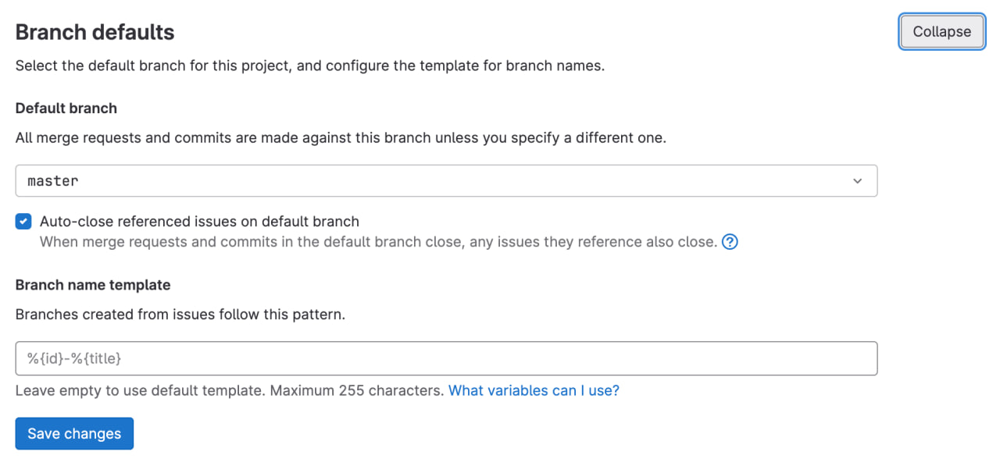
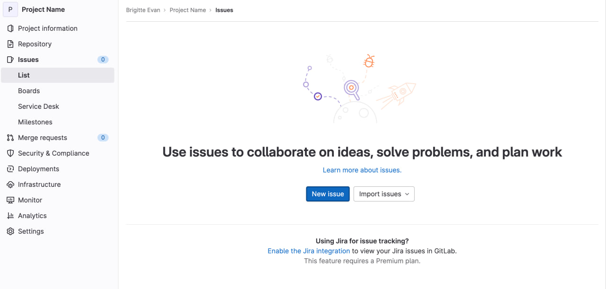
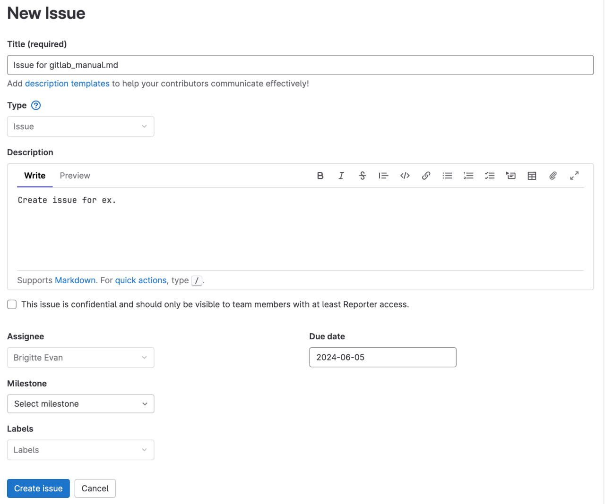

# Создание личного репозитория с нужным .gitignore и простым README.MD 

**Репозиторий** — это все файлы, находящиеся под контролем версий, вместе с историей их изменения и другой служебной информацией. 

Репозиторий Git **можно создать**, либо выбрав любую папку на компьютере, либо клонировав себе уже существующий репозиторий, например у работодателя или знакомого.
> **Заметка:** Репозитории бывают как закрытыми, так и открытыми. Когда разработчик желает поделиться своим исходным (source) кодом, то создает открытый репозиторий к которому доступ имеет каждый желающий.

При создании личного репозитория, вы можете создать его как **через терминал**, так и **через веб-сайт** используя удобный GUI.

Каждый выбирает способ удобнее для самого себя, мы разберем самый простой и понятный для начинающих разработчиков - использование оболочки **GitLab**.

 1. **Авторизуйтесь** под своим логином и паролем в системе [GitLab](https://about.gitlab.com/).
 2. Откройте список **своих репозиториев** [(Projects)](https://repos.21-school.ru/) 
 
 3. **При нажатии** на кнопку [New Project](https://repos.21-school.ru/projects/new) вам будет предложено создать **пустой проект** [(Create Blank Project)](https://repos.21-school.ru/projects/new#blank_project)
 
 4. Введите в поле **Project name** название своего проекта (репозитория), **выберите условия приватности репозитория** (открытый или приватный репозиторий вы хотите создать) после чего нажмите на кнопку **Create Project**.
 
 
 **Поздравляем**! Вы создали свой первый репозиторий.

# Создание веток develop и master
В любом репозитории может быть **несколько веток**. Каждая ветка - это грубо говоря отдельный, маленький мирок, в котором вы можете реализовывать разные задачи.
Например, в одной ветке можете работать вы, в другой коллега. В одной ветке вы используете одну реализацию своего кода, в другой используете иную. **Вариаций использования веток - множество**.

Самые популярные методы создания веток, либо через терминал и использование **SSH ключа** для связки вашего аккаунта, либо использование **визуальной оболочки GitLab**. 

Самым простым способом создания веток для новых разработчиков является **визуальная оболочка**, именно ее мы и разберем сегодня.

 1. **Авторизуйтесь** под своим логином и паролем в системе [GitLab](https://about.gitlab.com/).
 2. При создании репозитория, ветка **master** появляется автоматически. Создавать ее дополнительно нет необходимости. 
 3. Наводимся на вкладку "**Repository**", выбираем в выпавшем списке "[Branches](https://repos.21-school.ru/brigitev/project-name/-/branches)".
 
 4. В новой вкладке у нас появляется доступ к кнопке "[New Branch](https://repos.21-school.ru/brigitev/project-name/-/branches/new)", которая и позволит создать новую ветку.
 
 5. В пункт "**Branch Name**" вводим желаемое название для нашей новой ветки, к примеру, "develop". Далее, в пункте "**Create From**"* мы должны указать, от какой ветки мы создаем нашу новую ветку.
 
> **Заметка:** Create From означает, от какой ветки будет собрана полная информация для нашей новой ветки. То есть, если у нас есть две ветки master и main,  при том что в master будет файл echo.sh, а в main test.sh, при выборе ветки master, наша новая ветка будет с файлом echo.sh, но без test.sh.

После выполненных действий, **ветка будет создана**.

# Установка ветки develop по умолчанию
По умолчанию, ваша главная ветка всегда будет master. В зависимости от задач, может понадобится изменение основной ветки на другую.

Самые популярные методы создания веток, либо через терминал и использование **SSH ключа** для связки вашего аккаунта, либо использование **визуальной оболочки GitLab**. 

Самым простым способом создания веток для новых разработчиков является  **визуальная оболочка**, именно ее мы и разберем сегодня.

 1. **Авторизуйтесь** под своим логином и паролем в системе [GitLab](https://about.gitlab.com/).
 2. Перейдите в необходимый репозиторий на [GitLab](https://repos.21-school.ru/brigitev/project-name/-/settings/repository).
 
 3. Наведитесь на пункт "**Settings**", из выпадающего списка выберите "Repository"
 
 4. В "**Repository**" выбираем вкладку "**Branch Defaults**", развернув ее, вы можете выбрать необходимую ветку как ветку по умолчанию.

# Создание issue на создание текущего мануала
**Issue** - выявленная проблема, которая требует решения. Вы можете создать issue для того, чтобы сообщить о проблеме и рассказать о ней подробнее, а так же вести в ней полную цепочку информации по возникновению проблемы.

Самые популярные методы создания issue, либо через терминал и использование **SSH ключа** для связки вашего аккаунта, либо использование **визуальной оболочки GitLab**. 

Самым простым способом создания issue для новых разработчиков является  **визуальная оболочка**, именно ее мы и разберем сегодня.

 1. Наводимся на вкладка **issues**, там же находим **List**.
 
 2. После нажатия вкладки **List**, появляется кнопка "**New Issue**", которая нас переводит в режим создания.
 
 3. Указываем необходимые для вас данные, после чего подтверждаем через кнопку "**Create Issue**".

# Создание ветки по issue
 1. Наводимся на вкладку **Issues**, выбираем **List**
 2. Во вкладке **List** выбираем необходимый issue
 3. В нашем **issue** выбираем "**Move to branch**", указываем необходимые данные и создаем ветку по issue.

# Создание merge request по ветке в develop
**Merge request** - это  **запрос на слияние веток**. Необходимость использования этой функции может возникнуть тогда, когда нужно перенести функциональность из одной ветки в другую.

 1. В левом выпадающем списке выбираем "merge request"
 
 2. Выбираем create merge request.
 3. С левой стороны заполняем откуда будут браться файлы для мержа, в правой стороне - куда.
 

После этого, merge request будет создан. 
# Комментирование и принятие реквеста

 1. В созданном Merge Request выбираем Activity, там мы можем оставить комментарий на созданный мерж реквест.
 
 
 2. Выше вкладки Activity, присутствует вкладка "Ready to merge!", при нажатии на "Merge", файлы из исходной ветки будут перенесены в выбранную.
 

# Формирование стабильной версии в master с простановкой тега

 1. Во вкладке Repository выбираем вкладку "tags"
 2. Выбираем "new tag"
 3. Заполняем всю необходимую информацию

# Работа с wiki проекта

WIKI проекта является readme.md которая находится в репозитории. В ней используется markdown разметка, благодаря которой вы можете наблюдать минималистичный и удобный дизайн, различный функционал позволяющий перемещаться между пунктами.

